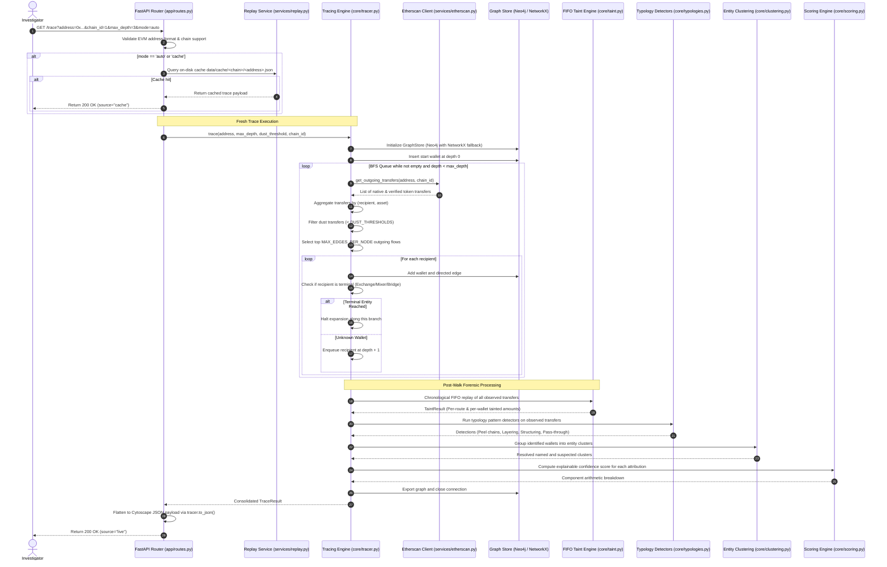

# System Architecture

## Overview

ChainSAHYOG is structured as a decoupled, high-performance forensic analysis engine built in Python 3.11+ with FastAPI. It adheres strictly to modular separation of concerns across three core architectural tiers:

```
backend/
├── app/                       # HTTP API & Configuration Layer
│   ├── __init__.py            #   FastAPI factory, lifespan, CORS configuration
│   ├── config.py              #   Central configuration, credentials, thresholds, token allowlists
│   └── routes.py              #   API route handlers (/trace, /report, /health, /demos, /)
│
├── core/                      # Analytical & Forensic Core Engines
│   ├── __init__.py
│   ├── tracer.py              #   Forward BFS traversal, multi-asset aggregation, termination classifier
│   ├── identify.py            #   Exchange identification (known labels & consolidation heuristic)
│   ├── clustering.py          #   Entity resolution (named clusters & deposit hub grouping)
│   ├── taint.py               #   FIFO value taint accounting & chronological event replay
│   ├── typologies.py          #   Laundering pattern recognition (peel chains, layering, structuring)
│   └── scoring.py             #   Explainable, additive confidence scoring
│
└── services/                  # Data Sources, Graph Storage, & Integration Layer
    ├── __init__.py
    ├── etherscan.py           #   Async Etherscan V2 multichain client, rate limiting, memory caching
    ├── graph_store.py         #   Dual graph storage: Neo4j engine with automatic NetworkX fallback
    ├── replay.py              #   Deterministic demo recording and zero-latency cache replay
    └── report.py              #   Forensic PDF report generation via ReportLab
```

---

## Architectural Tiers

### 1. HTTP Presentation Layer (`app/`)
- **FastAPI Framework**: Provides asynchronous request handling, schema validation, and automatic OpenAPI documentation.
- **Single Point of Configuration (`app/config.py`)**: All environment variables, API credentials, chain specifications, contract addresses, decimals, and heuristic thresholds are declared in `config.py`. No other module touches `os.environ`.
- **Validation & Serialization**: Ensures addresses are strictly formatted EVM hex strings (0x + 40 characters) and query parameters fall within valid bounds.

### 2. Forensic Core Engines (`core/`)
- **Forward Traversal Engine (`core/tracer.py`)**: Executes a forward Breadth-First Search (BFS) walk from the suspect wallet, pruning noise via asset-specific dust thresholds and bounding graph explosion with strict node/edge caps.
- **Entity Identification (`core/identify.py`)**: Evaluates wallets against known label registries (`labels.json`, OFAC sanctions) and checks for exchange sweep patterns.
- **Entity Resolution & Clustering (`core/clustering.py`)**: Aggregates disparate deposit and hot wallets belonging to the same institution into consolidated `Cluster` objects, calculating the shortest distance to the entity.
- **FIFO Taint Engine (`core/taint.py`)**: Replays observed transfers chronologically to quantify the exact volume of suspect funds arriving at target exchanges using First-In-First-Out accounting.
- **Laundering Typologies Engine (`core/typologies.py`)**: Analyzes transfer geometry and timing to detect peeling, layering, structuring, and pass-through conduit behavior.
- **Confidence Scoring (`core/scoring.py`)**: Evaluates identification certainty, network distance, and path cleanliness to generate an auditable score between 5% and 95%.

### 3. Services & Data Layer (`services/`)
- **Etherscan V2 Client (`services/etherscan.py`)**: Fetches native transactions and contract-pinned ERC-20 transfers across all supported EVM chains using a single API key, enforced rate delays, and in-memory caching.
- **Dual-Engine Graph Store (`services/graph_store.py`)**: Abstracts graph storage through a common interface, attempting to persist to Neo4j while seamlessly falling back to NetworkX if Neo4j is offline.
- **Replay Service (`services/replay.py`)**: Reads and writes pre-recorded forensic traces from `data/cache/<address>.json` for offline demonstrations.
- **Report Service (`services/report.py`)**: Synthesizes tracing findings, taint accounting, typologies, and evidence tables into printable PDF documents for court submission.

---

## Dual-Backend Graph Architecture

ChainSAHYOG implements a dual-engine graph architecture designed for operational resilience during critical operations:

```
                    ┌─────────────────────────┐
                    │  Tracing Engine         │
                    │  (core/tracer.py)       │
                    └────────────┬────────────┘
                                 │
                                 ▼
                    ┌─────────────────────────┐
                    │  GraphStore Factory     │
                    │  (services/graph_store) │
                    └────────────┬────────────┘
                                 │
                 ┌───────────────┴───────────────┐
                 ▼                               ▼
       ┌───────────────────┐           ┌───────────────────┐
       │   Neo4j Engine    │           │  NetworkX Engine  │
       │  (Docker / Bolt)  │           │   (In-Memory)     │
       ├───────────────────┤           ├───────────────────┤
       │ • Persistent Cypher│           │ • Zero dependency │
       │ • Batch writes    │  Failover │ • 100% in-process │
       │ • Cross-case links│──────────>│ • Deterministic   │
       │ • Connect timeout │           │ • Fast execution  │
       └───────────────────┘           └───────────────────┘
```

1. **Neo4j Graph Database**:
   - Connection via Bolt protocol (`bolt://localhost:7687`).
   - Uses batch buffering to commit wallets and edges in bulk, minimizing round-trip latency.
   - Provides graph persistence for cross-case correlation (e.g., discovering that two separate investigations share an unhosted conduit wallet).
2. **NetworkX Fallback**:
   - Pure Python in-memory directed graph (`networkx.DiGraph`).
   - Operates with zero external dependencies.
   - Automatically activates if Neo4j connection times out (4.0s timeout) or if `NEO4J_DISABLED=1` is set.
   - Both backends adhere to the identical interface contract and pass the agreement test suite (`tests/test_backends_agree.py`).

---

## Multi-Chain EVM Architecture

ChainSAHYOG utilizes Etherscan API V2's multichain architecture. Rather than maintaining disparate RPC nodes or API keys for every blockchain, a single Etherscan key and unified endpoint (`https://api.etherscan.io/v2/api`) serve all supported chains via the `chainid` query parameter:

| Chain ID | Network Slug | Display Name | Native Gas Token | Explorer Base URL |
| :---: | :---: | :---: | :---: | :---: |
| **1** | `ethereum` | Ethereum (Default) | `ETH` | `https://etherscan.io` |
| **137** | `polygon` | Polygon | `POL` | `https://polygonscan.com` |
| **56** | `bnb` | BNB Chain | `BNB` | `https://bscscan.com` |
| **42161** | `arbitrum` | Arbitrum One | `ETH` | `https://arbiscan.io` |

Each chain maintains its own:
- Contract-pinned ERC-20 allowlist (USDT, USDC, DAI, WETH, WBTC).
- Verified token decimals (e.g., USDT has 6 decimals on Ethereum and 18 decimals on BNB Chain).
- Native dust threshold and asset-specific dust floors.
- Independent on-disk replay cache and process cache isolation.

---

## End-to-End Execution Flow

The sequence diagram below traces an investigation request from inception to final attribution:


